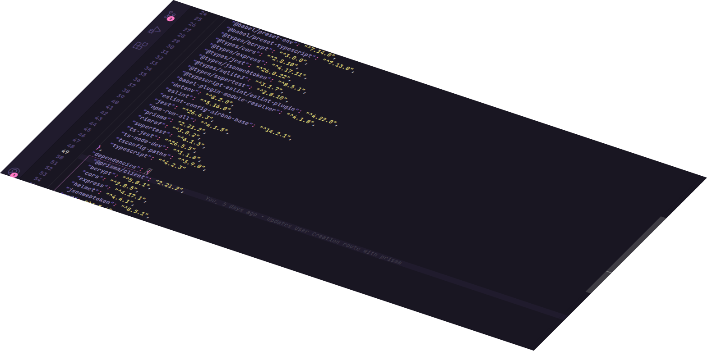

<p align="center">
  <a>
    
  </a>
  
</p>

<p align="center">
  easy-to-use scalable Node.js back-end 🚀
</p>

<h1></h1>

<div align="center">
  

  

  

  <br>
  <br>
  <br>
  <br>

  
</div>

<br>
<br>
<br>
<br>

<h1 align="center">
  <strong>💻 Project</strong>
</h1>

<p>
  <h2><strong>Overview</strong></h2>
  This is a scalable, easy to use, "batteries included" boilerplate for your e-commerce projects, by using a specific set of technolgies the learning curve is almost flat, write complex SQL queries in no time, feel the power of a simple but yet great authentication system and build your e-commerce now! 🚀
  <ul>
    <li><a href=""><strong>Getting Started</strong></a></li>
  </ul>

  <br>
  <h2><strong>Need Help?</strong></h2>
  Open an issue and tell your problem, our team will help you as soon as possible!

  <br>
  <br>
  <h2><strong>Roadmap</strong></h2>
  If there is a feature we don't have and you think it would be great, be sure to check our <a href="">roadmap</a> to see if the feature is already planned for the future.

  <br>
  <br>
  <h2><strong>Contributing</strong></h2>
  We still don't have CI/CD implemented to test your code when submitted, when we do, be ready to write code at light speed!

  <br>
  <br>
  <h2><strong>License</strong></h2>
  Esse projeto está sobre a licensa do MIT.
  Veja a <a href="LICENSE.md">Licensa</a> para mais detalhes.

  <br>
  <br>
  <small>This project was originally developed for the e-commerce <strong>Neo Expensive</strong></small>
</p>

<br>
<br>
<br>
<br>

<h1 align="center">
  <strong>🚀 Getting Started</strong>
</h1>
<p>
  <strong>Clone the repository</strong>

  ```bash
  git clone https://github.com/EsquemaFlorescer/E-commerce.git
  ```
</p>
<p>
  <strong>Access the folder</strong>

  ```bash
  cd E-commerce
  ```
</p>
<p>
  <strong>Install the dependencies</strong>

  ```bash
  yarn
  ```
</p>
<p>
  <strong>Start the development server</strong>

  ```bash
  # automatically runs the migrations
  yarn dev
  ```
</p>
<p>
  <strong>Run the tests</strong>

  ```bash
  # automatically resets the database
  yarn test
  ```
</p>
<p>
  <strong>Create the project build</strong>

  ```bash
  # automatically removes existing "build" folder
  yarn build
  ```
</p>
<p>
  <strong>Start the production server</strong>

  ```bash
  yarn start
  ```
</p>

<br>
<br>
<br>
<br>

<h1 align="center">
  <strong>🧪 Technologies</strong>
</h1>

<p>
  This is a RESTful Node.js API, built with market trending technologies such as: 

  <a href="https://www.typescriptlang.org/">Typescript</a>
  
  <a href="https://babeljs.io/">Babel</a>

  <a href="https://eslint.org/">Eslint</a>

  <a href="https://pm2.keymetrics.io/">PM2</a>

  <a href="https://www.prisma.io/">Prisma</a>

  <a href="https://jestjs.io/pt-BR/">Jest</a>

  <a href="https://expressjs.com/">Express</a>

  <a href="https://yarnpkg.com/">Yarn</a>

  <a href="https://jwt.io/">JSON Web Token</a>
</p>

<h1></h1>